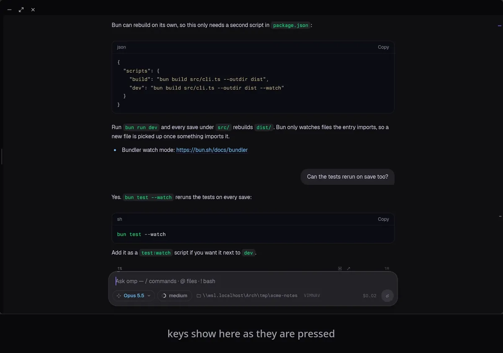

<h1 align="center">tern-omp-vimnav</h1>

<p align="center">
  Vim-style keyboard navigation of the <a href="https://github.com/can1357/oh-my-pi">omp</a> chat thread in the
  <a href="https://stencil.so/tern">Tern</a> terminal.
</p>

<p align="center">
  
</p>

Press Alt+K in omp and a cursor appears on the transcript itself: move block by block, open a block as text with a
row and column caret, select and copy text or whole blocks, quote into the prompt, search with `/`, and jump to links,
code blocks and buttons with Vimium-style `f` hints. Nothing is drawn in a separate pane, and the transcript's own
layout never shifts when the cursor moves.

<p align="center">
  
</p>

It works only in Tern, where omp renders its transcript natively. In any other terminal `/vimnav` says so and does
nothing.

## Requirements

- omp 18.6 or later (tested with 18.6.1)
- Tern 0.4 or later (tested with 0.4.5), with omp running directly in a Tern pane, not inside tmux, zellij or another
  multiplexer

## Install

The repository holds two parts: the omp extension (the repository root) and a small Tern plugin (`tern/`) that ships
the stylesheet and a palette command.

```sh
git clone https://github.com/DinMon/tern-omp-vimnav.git
omp plugin link ./tern-omp-vimnav
tern plugin install ./tern-omp-vimnav/tern
```

Use `tern plugin link ./tern-omp-vimnav/tern` instead of `install` to load the Tern plugin from the clone while you
work on it. Then restart omp and turn vimnav on:

```text
/vimnav on
```

The choice is saved in `~/.omp/agent/vimnav.json`. While vimnav is on, Tern's prompt shows a quiet `VIMNAV` label.

## Use

| Key | Does |
| --- | --- |
| Alt+K, or `/vimnav` | open the navigator; Alt+K again switches between it and the prompt |
| `j` `k`, `gg` `G` | next / previous block, first / last |
| `]]` `[[`, `]t` `[t` | your prompts, tool blocks |
| Ctrl+D Ctrl+U, Ctrl+F Ctrl+B | 5 blocks, 10 blocks |
| `V` | select blocks |
| `l` | expand the block's hidden output, then open it as text (TEXT) |
| `h` `j` `k` `l`, `w` `b` `e`, `0` `^` `$` | move in TEXT |
| `h` `h` at a line start | back to the block view; `h` there collapses the block again |
| `v` or Space, `V` | select text, select lines; `o` swaps the ends |
| `y` | copy the selected text, or the selected blocks |
| Enter | in TEXT: copy; in the block view: expand / collapse |
| `c` | quote into the prompt |
| `f`, `F` | hints: jump to a block, open a link, copy code, press a button; `F` copies instead |
| `/`, `n` `N` | search, next / previous match; matches show in TEXT as you type, Esc goes back to where you were |
| `?` | in the block view: every key; in TEXT: search backward |
| `za` or Tab, `zR` `zM` | expand / collapse, all |
| `zz` `zt` | scroll the cursor block into view / to the top |
| `i` | type in the prompt while vimnav stays open; Esc comes back |
| Esc, `q` | back one step, close |

Counts work on movements (`5j`).

Search covers the text that the TEXT view shows; lines hidden in collapsed tool output (the "57 earlier lines" kind)
are searched once that block is expanded (`za`, or `zR` for all).

### Tern palette

The Tern plugin adds "vimnav: open thread navigator" to the command palette (action `plugin.vimnav.open`). In an omp
pane it also replaces Tern's built-in "Open scrollback in editor" (`open_scrollback`): its key or palette row opens
vimnav instead, since vimnav is the way to browse omp's thread. Other panes keep the built-in.

## Uninstall

```sh
omp plugin uninstall tern-omp-vimnav
tern plugin remove vimnav   # or: tern plugin unlink vimnav
```

## How it works

omp describes each transcript block to Tern as a native node tree, and rebuilds a finished block from scratch whenever
its description changes, which Tern can draw as an empty gap. vimnav therefore never rewrites omp's blocks. It
overrides the transcript's block list to add invisible marker nodes next to them, and the stylesheet draws the cursor,
range and scroll margins through those markers. The TEXT view is vimnav's own node, placed next to the block it shows,
which is kept laid out at zero height so Tern keeps its content mounted. Hint labels are the one change made inside
blocks, and only while hints are up.

## License

[MIT](LICENSE)
